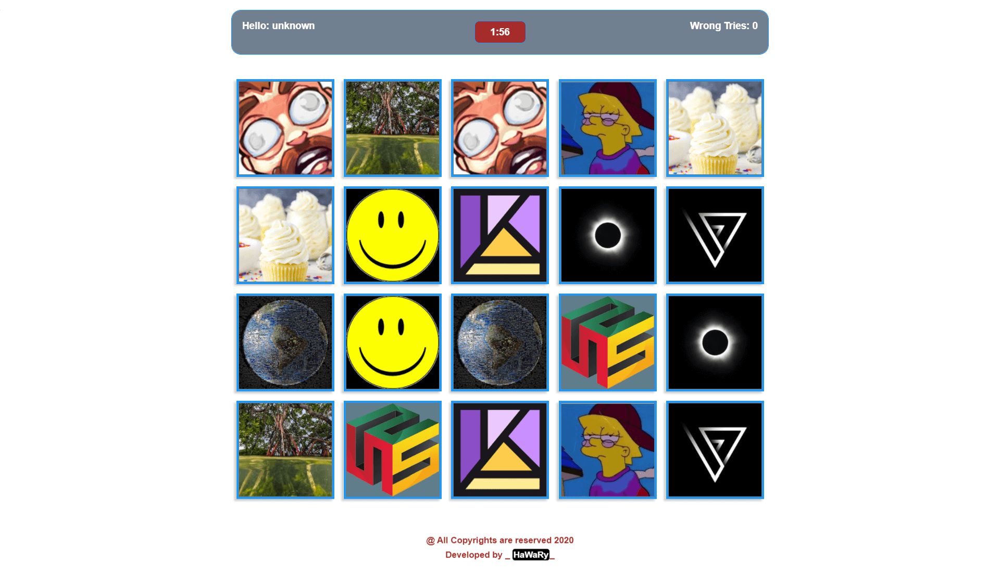

# memory-boxes  

  

Memory Boxes is a memory game App that depends on how you can match every two similar boxes together before time is gone out.

You can view the App from [here](https://memoryboxes.netlify.app/)

